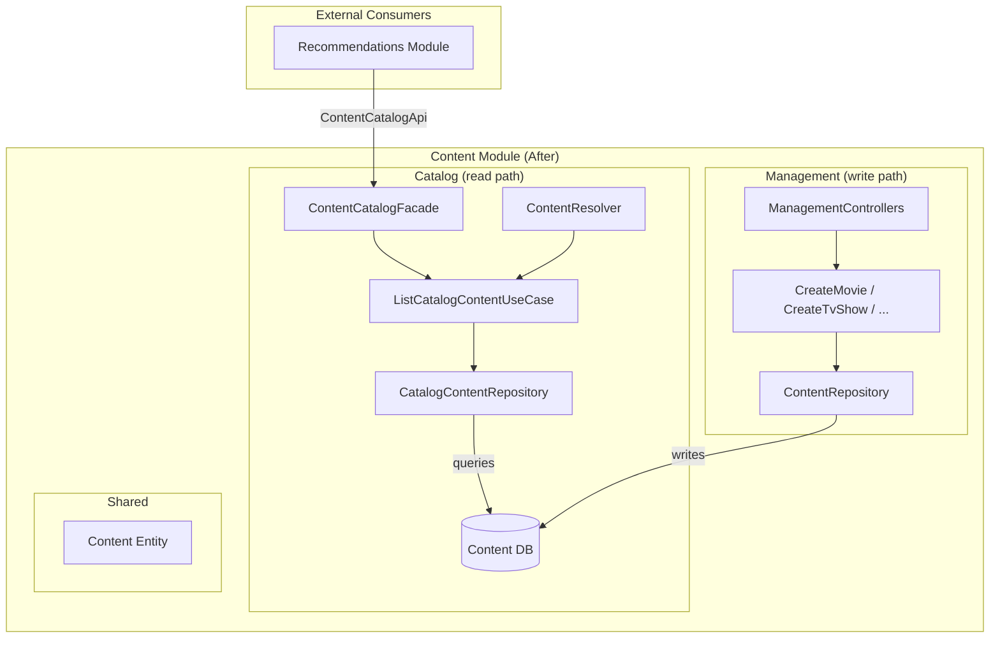

# Catalog Persistence Ownership Design

**Spec**: `.specs/features/catalog-persistence-ownership/spec.md`
**Status**: Draft

---

## Architecture Overview

Transfer read-side catalog ownership from the management subdomain to the catalog subdomain. Management keeps write-side CRUD; catalog gets its own repository, use case, facade, and the `ContentCatalogApi` binding.



**Key insight**: Both management and catalog have their own repository class wrapping the same shared `Content` entity and `content` datasource. Management's `ContentRepository` is write-focused (save, saveMovieContent, saveTvShowContent). Catalog's `CatalogContentRepository` is read-focused (find, findWithRelations). No entity changes needed.

---

## Code Reuse Analysis

### Existing Components to Leverage

| Component | Location | How to Use |
| --- | --- | --- |
| `DefaultTypeOrmRepository` | `@tlc/shared-module/typeorm` | Base class for `CatalogContentRepository` |
| `Content` / `MovieContent` / `TvShowContent` | `package/content/shared/persistence/entity/content.entity.ts` | Reuse as-is — catalog queries, doesn't own |
| `ContentCatalogApi` / `ContentCatalogItem` | `@tlc/shared-module/public-api` | Interface already exists — just re-bind provider |
| `ContentSharedModule` | `package/content/shared/content-shared.module.ts` | Provides TypeORM connection — catalog already imports it |
| Management's `ListCatalogContentUseCase` | `package/content/management/core/use-case/list-catalog-content.use-case.ts` | Pattern to replicate (adapt to use catalog's repo) |
| Management's `ContentCatalogFacade` | `package/content/management/public-api/facade/content-catalog.facade.ts` | Pattern to replicate (adapt to use catalog's use case) |

### Integration Points

| System | Integration Method |
| --- | --- |
| Recommendations module | Injects `ContentCatalogApi` token — no change to consumer code |
| Content DB (`content` datasource) | `@InjectDataSource('content')` — same connection, new repository class |
| GraphQL resolver | `ContentResolver` switches from stub `ListContentUseCase` to real `ListCatalogContentUseCase` |

---

## Components

### CatalogContentRepository

- **Purpose**: Read-focused repository for querying content in the catalog subdomain
- **Location**: `package/content/catalog/persistence/repository/catalog-content.repository.ts`
- **Interfaces**:
  - Inherits `find(options)`, `findOne(options)` from `DefaultTypeOrmRepository<Content>`
- **Dependencies**: `@InjectDataSource('content')` for the shared content datasource
- **Reuses**: `DefaultTypeOrmRepository` base class, same pattern as management's `ContentRepository`

### ListCatalogContentUseCase (moved to catalog)

- **Purpose**: Query all content with genres for the catalog API
- **Location**: `package/content/catalog/core/use-case/list-catalog-content.use-case.ts`
- **Interfaces**:
  - `execute(): Promise<ContentCatalogItem[]>`
- **Dependencies**: `CatalogContentRepository`
- **Reuses**: Logic from management's `ListCatalogContentUseCase` (adapted to use catalog's repo)

### ContentCatalogFacade (moved to catalog)

- **Purpose**: Implements `ContentCatalogApi` for cross-module access to the content catalog
- **Location**: `package/content/catalog/public-api/facade/content-catalog.facade.ts`
- **Interfaces**:
  - `findAllWithGenres(): Promise<ContentCatalogItem[]>` (implements `ContentCatalogApi`)
- **Dependencies**: `ListCatalogContentUseCase`
- **Reuses**: Same delegation pattern as management's `ContentCatalogFacade`

### ListContentUseCase (updated)

- **Purpose**: Serve the GraphQL `listContent` query with real data
- **Location**: `package/content/catalog/core/use-case/list-content.use-case.ts` (existing, updated)
- **Interfaces**:
  - `execute(): Promise<Content[]>`
- **Dependencies**: `CatalogContentRepository`
- **Reuses**: Existing file — replace stub implementation

---

## Module Wiring Changes

### ContentCatalogModule (after)

```typescript
@Module({
  imports: [ContentSharedModule, ContentMediaModule, LoggerModule, HttpClientModule],
  providers: [
    CatalogContentRepository,
    ListCatalogContentUseCase,
    ContentCatalogFacade,
    { provide: ContentCatalogApi, useClass: ContentCatalogFacade },
    ContentResolver,
    VideoResolver,
    GetStreamingURLUseCase,
    ListContentUseCase,
    VideoStreamingService,
  ],
  controllers: [MediaPlayerController],
  exports: [ContentCatalogApi],
})
export class ContentCatalogModule {}
```

### ContentManagementModule (after — removed lines)

```diff
- ListCatalogContentUseCase,
- ContentCatalogFacade,
- { provide: ContentCatalogApi, useClass: ContentCatalogFacade },
...
- exports: [ContentCatalogApi],
+ exports: [],
```

### ContentModule (after)

```diff
- exports: [ContentManagementModule],
+ exports: [ContentCatalogModule],
```

---

## Error Handling Strategy

| Error Scenario | Handling | User Impact |
| --- | --- | --- |
| DB connection failure in CatalogContentRepository | TypeORM propagates error (same as today) | 500 — no change in behavior |
| Empty content catalog | Returns `[]` from facade and resolver | Empty recommendation results (existing behavior) |

---

## Tech Decisions (only non-obvious ones)

| Decision | Choice | Rationale |
| --- | --- | --- |
| Separate repository class vs reusing management's | Separate `CatalogContentRepository` | Each subdomain owns its repos per architecture principles. Even though the entity is shared, the repo is subdomain-scoped. Allows read-optimized queries later (search, filtering) without touching management. |
| Fix `ListContentUseCase` vs replace with `ListCatalogContentUseCase` | Fix existing + keep both | `ListContentUseCase` serves GraphQL (returns `Content[]`). `ListCatalogContentUseCase` serves the public API (returns `ContentCatalogItem[]`). Different return types, different consumers. Both use `CatalogContentRepository`. |
| Datasource factory changes | None needed | `Content` entity lives in `shared/persistence/entity/` which is already scanned. No new entities are being created. |
