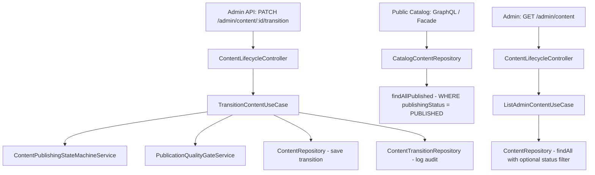

# Content Lifecycle Core Design

**Spec:** `.specs/features/content-lifecycle-core/spec.md`
**Status:** Draft

---

## Architecture Overview

The lifecycle feature adds a publishing state machine to the existing `Content` entity (in `content/shared`), a new lifecycle subdomain under `content/management` for transition logic, and modifies `content/catalog` to filter by publishing status. The state machine follows the established `SubscriptionStateMachineService` pattern from billing.



---

## Code Reuse Analysis

### Existing Components to Leverage

| Component | Location | How to Use |
|---|---|---|
| `SubscriptionStateMachineService` | `package/billing/core/service/subscription-state-machine.service.ts` | **Pattern reference** — same `Map<Status, AllowedStatuses[]>` + `transition()` approach |
| `DefaultTypeOrmRepository` | `package/shared/module/typeorm/repository/default-typeorm.repository.ts` | Base class for `ContentTransitionRepository` |
| `Content` entity | `package/content/shared/persistence/entity/content.entity.ts` | Add `publishingStatus` column to existing entity |
| `ContentRepository` (management) | `package/content/management/persistence/repository/content.repository.ts` | Extend with status-aware query methods |
| `CatalogContentRepository` | `package/content/catalog/persistence/repository/catalog-content.repository.ts` | Modify `findAll()` to filter by PUBLISHED |
| `AdminGuard` | `package/shared/module/auth/http/guard/admin.guard.ts` | Protect new admin endpoints |
| `ContentManagementModule` | `package/content/management/content-management.module.ts` | Register new lifecycle providers |
| `ContentCatalogModule` | `package/content/catalog/content-catalog.module.ts` | No changes needed — filtering happens in repository |

### Integration Points

| System | Integration Method |
|---|---|
| Public catalog (GraphQL) | `CatalogContentRepository.findAll()` adds `WHERE publishingStatus = PUBLISHED` |
| Cross-module facade | `ContentCatalogFacade` → `ListCatalogContentUseCase` → repository — filter propagates automatically |
| Recommendations | `ContentCatalogApi.findAllWithGenres()` transparently returns only PUBLISHED — no changes needed in recommendations module |
| Existing content creation | `CreateMovieUseCase` and `CreateTvShowUseCase` — entity factory sets `publishingStatus = DRAFT` |

---

## Components

### PublishingStatus Enum

- **Purpose:** Define the four publishing states
- **Location:** `package/content/shared/core/enum/publishing-status.enum.ts`
- **Values:** `DRAFT`, `REVIEW`, `PUBLISHED`, `ARCHIVED`

### ContentPublishingStateMachineService

- **Purpose:** Validate and execute state transitions following the billing pattern
- **Location:** `package/content/management/core/service/content-publishing-state-machine.service.ts`
- **Interfaces:**
  - `transition(content: Content, targetState: PublishingStatus): void` — validates and mutates
  - `getAllowedTransitions(currentState: PublishingStatus): PublishingStatus[]` — returns valid targets
- **Dependencies:** None (pure domain logic)
- **Reuses:** `SubscriptionStateMachineService` pattern from billing

### PublicationQualityGateService

- **Purpose:** Validate quality gates before REVIEW → PUBLISHED (and ARCHIVED → PUBLISHED)
- **Location:** `package/content/management/core/service/publication-quality-gate.service.ts`
- **Interfaces:**
  - `validate(content: Content): QualityGateResult` — returns pass/fail with failure details
- **Dependencies:** `ContentRepository` (to load relations: thumbnail, episodes)
- **Reuses:** None (new logic, but follows validation pattern from class-validator DTOs)

### TransitionContentUseCase

- **Purpose:** Orchestrate a state transition: validate transition → check gates → save → log audit
- **Location:** `package/content/management/core/use-case/transition-content.use-case.ts`
- **Interfaces:**
  - `execute(contentId: string, targetState: PublishingStatus, triggeredBy: string, reason?: string): Promise<Content>`
- **Dependencies:** `ContentRepository`, `ContentPublishingStateMachineService`, `PublicationQualityGateService`, `ContentTransitionRepository`
- **Reuses:** `@Transactional({ connectionName: 'content' })` pattern

### ListAdminContentUseCase

- **Purpose:** List content for admin with optional status filter
- **Location:** `package/content/management/core/use-case/list-admin-content.use-case.ts`
- **Interfaces:**
  - `execute(filters?: { statuses?: PublishingStatus[] }): Promise<Content[]>`
- **Dependencies:** `ContentRepository`

### GetAdminContentUseCase

- **Purpose:** Get a single content item by ID (admin view, includes publishingStatus)
- **Location:** `package/content/management/core/use-case/get-admin-content.use-case.ts`
- **Interfaces:**
  - `execute(contentId: string): Promise<Content>`
- **Dependencies:** `ContentRepository`

### ContentLifecycleController

- **Purpose:** REST endpoints for state transitions and admin content listing
- **Location:** `package/content/management/http/rest/controller/content-lifecycle.controller.ts`
- **Interfaces:**
  - `PATCH /admin/content/:id/transition` — transition a content item
  - `GET /admin/content` — list all content with optional status filter
  - `GET /admin/content/:id` — get single content item
- **Dependencies:** `TransitionContentUseCase`, `ListAdminContentUseCase`, `GetAdminContentUseCase`, `ClsService`
- **Reuses:** Lean controller pattern, `AdminGuard`, `ValidationPipe`

### ContentTransitionRepository

- **Purpose:** Persist state transition audit records
- **Location:** `package/content/management/persistence/repository/content-transition.repository.ts`
- **Interfaces:**
  - `save(transition: ContentTransition): Promise<ContentTransition>`
- **Dependencies:** `@InjectDataSource('content')`
- **Reuses:** `DefaultTypeOrmRepository<ContentTransition>`

### ContentTransition Entity

- **Purpose:** Audit trail entity for state transitions
- **Location:** `package/content/shared/persistence/entity/content-transition.entity.ts`
- **Fields:** `id`, `contentId`, `previousState`, `newState`, `triggeredBy`, `reason`, `timestamp`
- **Reuses:** `DefaultEntity` base class

---

## Data Models

### PublishingStatus Enum

```typescript
export enum PublishingStatus {
  DRAFT = 'DRAFT',
  REVIEW = 'REVIEW',
  PUBLISHED = 'PUBLISHED',
  ARCHIVED = 'ARCHIVED',
}
```

### Content Entity (modified)

```typescript
// Added to existing Content abstract class
@Column({
  type: 'enum',
  enum: PublishingStatus,
  default: PublishingStatus.DRAFT,
})
publishingStatus: PublishingStatus;
```

### ContentTransition Entity (new)

```typescript
@Entity({ name: 'ContentTransition' })
export class ContentTransition extends DefaultEntity<ContentTransition> {
  @Column({ type: 'uuid' })
  contentId: string;

  @Column({ type: 'enum', enum: PublishingStatus })
  previousState: PublishingStatus;

  @Column({ type: 'enum', enum: PublishingStatus })
  newState: PublishingStatus;

  @Column({ type: 'varchar' })
  triggeredBy: string;

  @Column({ type: 'varchar', nullable: true })
  reason: string | null;

  @Column({ type: 'timestamptz', default: () => 'CURRENT_TIMESTAMP' })
  transitionedAt: Date;
}
```

### Allowed Transitions Map

```
DRAFT      → [REVIEW]
REVIEW     → [PUBLISHED, DRAFT]
PUBLISHED  → [ARCHIVED]
ARCHIVED   → [PUBLISHED]
```

Note: REVIEW → PUBLISHED requires quality gates. ARCHIVED → PUBLISHED requires quality gates.

### Quality Gate Validation Result

```typescript
interface QualityGateResult {
  passed: boolean;
  failures: QualityGateFailure[];
}

interface QualityGateFailure {
  field: string;
  rule: string;
  message: string;
}
```

---

## Error Handling Strategy

| Error Scenario | Handling | User Impact |
|---|---|---|
| Invalid state transition | `422 Unprocessable Entity` with allowed transitions | Admin sees clear error with valid options |
| Quality gate failure | `422 Unprocessable Entity` with failure array | Admin sees exactly which gates failed |
| Content not found | `404 Not Found` | Admin sees "content not found" |
| Missing targetState in body | `400 Bad Request` (ValidationPipe) | Admin sees validation error |

---

## Tech Decisions

| Decision | Choice | Rationale |
|---|---|---|
| State machine location | `content/management` | Management owns admin operations; catalog only reads |
| ContentTransition entity location | `content/shared` | Needs to be visible to management (writes) and potentially catalog (reads in dashboard) |
| Quality gate as separate service | Yes | Single Responsibility — state machine validates transitions, gate service validates content quality |
| Filter at repository level | Yes | Prevents "forgotten filter" — every query through `CatalogContentRepository` automatically filters |
| Migration strategy | Add column with DEFAULT, then UPDATE existing rows | Zero-downtime: new column defaults to DRAFT for new inserts, migration sets existing to PUBLISHED |

---

## Migration Strategy

1. **Add `publishingStatus` column** to `ContentItem` table with `DEFAULT 'DRAFT'`
2. **UPDATE** all existing rows to `PUBLISHED` (backward compatibility)
3. **Add `ContentTransition` table** for audit trail
4. Generated via `nx db:generate content`
