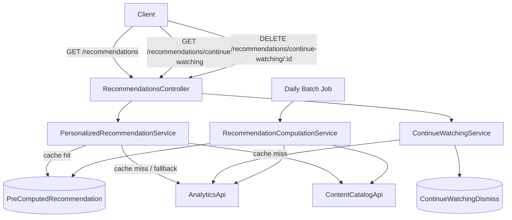

# Core Personalization Design

**Spec**: `.specs/features/core-personalization/spec.md`
**Status**: Draft

---

## Architecture Overview

New `@tlc/recommendations` package following the established modular monolith pattern. Two data flows:

- **"Recommended for You"**: Pre-computed daily batch + on-demand compute on first access. Stored in a `recommendations` datasource for fast reads.
- **"Continue Watching"**: Computed on-the-fly at request time from analytics watch history + dismiss state from `recommendations` datasource.

**Prerequisite**: The content module needs a `genres` column on its `Content` entity and a catalog query facade — genres are a content attribute, not an analytics construct, and every milestone (M1–M4) needs this data.



---

## Code Reuse Analysis

### Existing Components to Leverage

| Component | Location | How to Use |
| --- | --- | --- |
| `AnalyticsApi` interface + token | `@tlc/shared-module/public-api` | Inject via `@Inject(AnalyticsApi)` — already exported from `AnalyticsModule` |
| `DefaultTypeOrmRepository<T>` | `@tlc/shared-module/typeorm` | Extend for `PreComputedRecommendationRepository` and `ContinueWatchingDismissRepository` |
| `TypeOrmPersistenceModule.forRoot` | `@tlc/shared-module/typeorm` | Wire recommendations datasource with `addTransactionalDataSource` |
| `AuthGuard` / `ClsService` | `@tlc/shared-module/auth` | Extract `userId` from JWT in controller; optional auth for anonymous fallback |
| `DefaultEntity` | `@tlc/shared-module/typeorm` | Base class for new entities (id, createdAt, updatedAt, deletedAt) |
| `createNestApp` / `Tables` enum | `@tlc/shared-lib/test` | E2e test setup + DB cleanup |
| Config pattern (Zod) | Every existing package's `config.ts` | Follow same pattern for recommendations config |
| `DomainException` | `@tlc/shared-lib` | Custom exceptions if needed |

### Integration Points

| System | Integration Method |
| --- | --- |
| Analytics | `@Inject(AnalyticsApi)` — 5 methods: `getUserGenreAffinities`, `getUserWatchHistory`, `getUserResumePosition`, `getTrendingContent`, `getContentPerformanceMetrics` |
| Content Catalog | `@Inject(ContentCatalogApi)` — NEW shared interface (prerequisite) |
| PostgreSQL | Named datasource `recommendations` via TypeORM |
| Redis / BullMQ | Repeatable daily job for batch recomputation |
| Monolith app | Import `RecommendationsModule` + `recommendationsConfigFactory` in `MonolithModule` |

---

## Components

### Prerequisite: Content Module Changes

Before the recommendations module can work, the content module needs two small additions:

**1. Add `genres` column to `Content` entity**

- Location: `package/content/shared/persistence/entity/content.entity.ts`
- Column: `genres: string[]` (jsonb, default `[]`)
- Migration: `nx db:generate content`

**2. Create `ContentCatalogApi` shared interface + content facade**

- Interface: `package/shared/module/public-api/interface/content-catalog-public-api.interface.ts`
- Facade: `package/content/catalog/public-api/facade/content-catalog.facade.ts`
- Register in `ContentCatalogModule`, export from `ContentModule`

```typescript
interface ContentCatalogItem {
  id: string;
  title: string;
  type: string;
  genres: string[];
  releaseDate: Date | null;
}

interface ContentCatalogApi {
  findAllWithGenres(): Promise<ContentCatalogItem[]>;
}
```

---

### RecommendationsController

- **Purpose**: REST endpoints for recommendation surfaces. Lean — delegates to services.
- **Location**: `package/recommendations/http/rest/controller/recommendations.controller.ts`
- **Interfaces**:
  - `GET /recommendations` — returns personalized row (auth optional: logged-in gets personalized, anonymous gets trending)
  - `GET /recommendations/continue-watching` — returns continue watching row (auth required)
  - `DELETE /recommendations/continue-watching/:contentId` — dismiss item (auth required)
- **Dependencies**: `PersonalizedRecommendationService`, `ContinueWatchingService`, `ClsService`
- **Reuses**: `AuthGuard` (optional for GET /recommendations, required for continue-watching), `ValidationPipe`, `plainToInstance` for response DTOs

### PersonalizedRecommendationService

- **Purpose**: Retrieve or compute personalized recommendations for a user.
- **Location**: `package/recommendations/core/service/personalized-recommendation.service.ts`
- **Interfaces**:
  - `getForUser(userId: string | null): Promise<RecommendationItem[]>`
- **Logic**:
  1. If `userId` is null → return trending (REC-06)
  2. Check `PreComputedRecommendationRepository` for cached results
  3. If cache hit → return stored recommendations
  4. If cache miss → compute on-the-fly via `RecommendationComputationService.computeForUser(userId)`, store, return
  5. If no genre affinities → return trending (REC-03)
- **Dependencies**: `PreComputedRecommendationRepository`, `RecommendationComputationService`, `AnalyticsApi` (trending fallback)
- **Reuses**: `AnalyticsApi` (existing)

### ContinueWatchingService

- **Purpose**: Compute continue watching row on-the-fly from analytics data + dismiss state.
- **Location**: `package/recommendations/core/service/continue-watching.service.ts`
- **Interfaces**:
  - `getForUser(userId: string): Promise<ContinueWatchingItem[]>`
  - `dismissItem(userId: string, contentId: string): Promise<void>`
- **Logic for getForUser**:
  1. `analyticsApi.getUserWatchHistory(userId)` → all watch history
  2. Filter to partially watched only: `completionPercentage > 5 && completionPercentage < 90` (CW-01, CW-02)
  3. Get dismissed items from `ContinueWatchingDismissRepository` (CW-05)
  4. Exclude dismissed items
  5. Sort by `lastWatchedAt` descending
  6. Limit to 20 (CW-04)
  7. For each item: enrich with resume position via `analyticsApi.getUserResumePosition(userId, contentId)` (CW-03)
- **Logic for dismissItem**: Save to `ContinueWatchingDismissRepository` (CW-05)
- **Dependencies**: `AnalyticsApi`, `ContinueWatchingDismissRepository`
- **Reuses**: `AnalyticsApi` (existing)

### RecommendationComputationService

- **Purpose**: Core scoring logic — computes personalized recommendations for a user.
- **Location**: `package/recommendations/core/service/recommendation-computation.service.ts`
- **Interfaces**:
  - `computeForUser(userId: string): Promise<RecommendationItem[]>`
  - `recomputeAll(): Promise<void>` (batch — called by queue consumer)
- **Scoring algorithm** (v1 — simple, deterministic, debuggable):
  1. `analyticsApi.getUserGenreAffinities(userId)` → `{genre, affinityScore}[]`
  2. `analyticsApi.getUserWatchHistory(userId, { completedOnly: true })` → completed contentIds
  3. `contentCatalogApi.findAllWithGenres()` → all content with genres
  4. For each content item: `score = sum(affinityScore)` for each genre that matches user affinities
  5. Filter out completed content (REC-04)
  6. Filter out items with score = 0 (no genre match)
  7. Sort by score descending, take top 20 (REC-01)
  8. Store in `PreComputedRecommendationRepository`
- **recomputeAll logic**:
  1. Get distinct userIds from `PreComputedRecommendationRepository` (only users who accessed the feature)
  2. For each: `computeForUser(userId)` and overwrite stored results
  3. REC-05 satisfied: recommendations updated within 24h
- **Dependencies**: `AnalyticsApi`, `ContentCatalogApi`, `PreComputedRecommendationRepository`

### RecommendationComputationQueueConsumer

- **Purpose**: BullMQ consumer that triggers daily batch recomputation.
- **Location**: `package/recommendations/queue/consumer/recommendation-computation.queue-consumer.ts`
- **Interfaces**: `process(job: Job): Promise<void>`
- **Schedule**: Repeatable job, every 24h (configurable via config)
- **Dependencies**: `RecommendationComputationService`
- **Reuses**: BullMQ pattern from analytics (`TrendingComputationQueueConsumer`)

### PreComputedRecommendationRepository

- **Purpose**: Stores pre-computed recommendation results per user.
- **Location**: `package/recommendations/persistence/repository/pre-computed-recommendation.repository.ts`
- **Interfaces**:
  - `findByUserId(userId: string): Promise<PreComputedRecommendation[]>`
  - `replaceForUser(userId: string, items: PreComputedRecommendation[]): Promise<void>`
  - `getDistinctUserIds(): Promise<string[]>`
- **Dependencies**: `@InjectDataSource('recommendations')`
- **Reuses**: Extends `DefaultTypeOrmRepository<PreComputedRecommendation>`

### ContinueWatchingDismissRepository

- **Purpose**: Stores dismissed "Continue Watching" items per user.
- **Location**: `package/recommendations/persistence/repository/continue-watching-dismiss.repository.ts`
- **Interfaces**:
  - `findByUserId(userId: string): Promise<ContinueWatchingDismiss[]>`
  - `dismiss(userId: string, contentId: string): Promise<void>`
- **Dependencies**: `@InjectDataSource('recommendations')`
- **Reuses**: Extends `DefaultTypeOrmRepository<ContinueWatchingDismiss>`

---

## Data Models

### PreComputedRecommendation

```typescript
@Entity('recommendations_pre_computed')
class PreComputedRecommendation extends DefaultEntity {
  @Column()
  userId: string;

  @Column()
  contentId: string;

  @Column('decimal', { precision: 10, scale: 4 })
  score: number;

  @Column()
  rank: number;

  @Column('jsonb', { default: [] })
  matchedGenres: string[];

  @Column()
  computedAt: Date;
}
```

**Indexes**: `(userId)` for lookup, `(userId, contentId)` unique for upsert.

### ContinueWatchingDismiss

```typescript
@Entity('recommendations_continue_watching_dismiss')
class ContinueWatchingDismiss extends DefaultEntity {
  @Column()
  userId: string;

  @Column()
  contentId: string;

  @Column()
  dismissedAt: Date;
}
```

**Indexes**: `(userId)` for lookup, `(userId, contentId)` unique.

### Content Entity Change (prerequisite)

```typescript
// Added to existing Content entity
@Column('jsonb', { default: [] })
genres: string[];
```

---

## Error Handling Strategy

| Error Scenario | Handling | User Impact |
| --- | --- | --- |
| Analytics API unavailable | Catch, log warning, return trending fallback for personalized row; return empty for continue watching (REC-08) | Degraded but functional — user sees trending content |
| Content catalog API unavailable | Catch, log warning, return trending fallback | Same as above |
| No genre affinities for user | Return trending content (REC-03) | User sees popular content; improves as they watch more |
| No pre-computed recommendations | Compute on-the-fly, store, return | Slightly slower first request; subsequent requests are fast |
| Dismiss for non-existent content | Upsert dismiss record silently; orphan cleaned on next access (CW-07) | No visible impact |
| Batch job failure | Log error, retry via BullMQ retry policy; stale recommendations persist until next successful run | Recommendations may be slightly stale |

---

## Tech Decisions (only non-obvious ones)

| Decision | Choice | Rationale |
| --- | --- | --- |
| Genre data location | Add `genres` column to Content entity (content module) | Genres are intrinsic content metadata, not analytics. Every milestone (M1–M4) needs this data. One-time investment. |
| Personalized recs storage | Pre-computed in `recommendations` datasource | Follows AD-001 (batch over real-time). Fast reads at request time. Self-populating: first access triggers compute + store; batch job only refreshes known users. |
| Continue Watching computation | On-the-fly from analytics at request time | Watch history updates continuously via event processing. Pre-computing would add staleness with no benefit — the query is a simple filter + sort. |
| Scoring algorithm (v1) | `score = sum(affinityScore for matching genres)` | Simple, deterministic, debuggable. No ML. Easy to explain and iterate on. Sufficient for v1 metrics goals. |
| Batch user discovery | Query distinct userIds from `PreComputedRecommendation` table | Avoids modifying AnalyticsApi for user listing. Self-service: users register for recomputation when they first access recommendations. |
| ContentCatalogApi scope | `findAllWithGenres()` only | Minimal cross-module surface. Recommendations module handles filtering/scoring internally. Content module just serves the catalog. |
| Cross-module communication | Shared interface + Symbol token pattern (like `AnalyticsApi`) | Follows established facade pattern. Recommendations depends on abstraction, not on content/analytics internals. |

---

## Module Structure

```
package/recommendations/
├── recommendations.module.ts
├── config.ts
├── index.ts
├── core/
│   └── service/
│       ├── personalized-recommendation.service.ts
│       ├── continue-watching.service.ts
│       └── recommendation-computation.service.ts
├── http/
│   └── rest/
│       ├── controller/
│       │   └── recommendations.controller.ts
│       └── dto/
│           ├── recommendation-item.response-dto.ts
│           └── continue-watching-item.response-dto.ts
├── persistence/
│   ├── entity/
│   │   ├── pre-computed-recommendation.entity.ts
│   │   └── continue-watching-dismiss.entity.ts
│   ├── repository/
│   │   ├── pre-computed-recommendation.repository.ts
│   │   └── continue-watching-dismiss.repository.ts
│   ├── migration/
│   ├── recommendations-persistence.module.ts
│   ├── typeorm-datasource.ts
│   └── typeorm-datasource.factory.ts
├── queue/
│   └── consumer/
│       └── recommendation-computation.queue-consumer.ts
└── __test__/
    ├── e2e/
    │   └── recommendations/
    └── factory/
```

### Monolith Integration

`app/monolith/monolith.module.ts`: add `RecommendationsModule` to imports, add `recommendationsConfigFactory` to `ConfigModule.forRoot({ load: [...] })`.

### Workspace Setup

- `package/recommendations/package.json` (`@tlc/recommendations`)
- `package/recommendations/project.json` (with `test:unit`, `test:e2e`, `db:generate`, `db:migrate`, `lint:check` targets)
- `package/recommendations/jest.config.ts`
- `package/recommendations/tsconfig.json` + `tsconfig.lib.json` + `tsconfig.spec.json`
- Add `"package/recommendations"` to root `package.json` workspaces
