# Editorial Operations Design

**Spec:** `.specs/features/editorial-operations/spec.md`
**Status:** Draft

---

## Architecture Overview

Builds on M1's state machine. Adds scheduled publishing via BullMQ delayed jobs, archiving metadata fields, and pipeline aggregation queries. All new components live in `content/management` (admin operations).

```mermaid
graph TD
    subgraph "Scheduled Publishing"
        A[PATCH /admin/content/:id/transition with scheduledPublishAt] --> B[TransitionContentUseCase]
        B --> C[ScheduledPublishProducer - BullMQ delayed job]
        D[BullMQ fires at scheduledPublishAt] --> E[ScheduledPublishConsumer]
        E --> F[TransitionContentUseCase - auto-publish with SYSTEM actor]
        F --> G[Quality Gates re-checked at publish time]
    end

    subgraph "Pipeline Dashboard"
        H[GET /admin/content/pipeline/summary] --> I[PipelineDashboardController]
        I --> J[PipelineSummaryUseCase]
        J --> K[ContentRepository - aggregate by publishingStatus]
    end
    
    subgraph "Archiving"
        L[PUBLISHED → ARCHIVED] --> M[TransitionContentUseCase]
        M --> N[Set archivedAt + archivedBy on Content]
        O[ARCHIVED → PUBLISHED] --> P[TransitionContentUseCase]
        P --> Q[Re-run quality gates]
    end
```



---

## Code Reuse Analysis

### Existing Components to Leverage

| Component | Location | How to Use |
|---|---|---|
| `TransitionContentUseCase` (M1) | `package/content/management/core/use-case/transition-content.use-case.ts` | Extend to support `scheduledPublishAt` and archiving metadata |
| `ContentPublishingStateMachineService` (M1) | `package/content/management/core/service/content-publishing-state-machine.service.ts` | No changes — transitions already validated |
| `PublicationQualityGateService` (M1) | `package/content/management/core/service/publication-quality-gate.service.ts` | Re-used for scheduled publish gate check |
| BullMQ infrastructure | `package/content/shared/content-shared.module.ts` | Already configured with Redis connection; add new queue |
| `VideoProcessingJobProducer` pattern | `package/content/management/queue/producer/video-processing-job.queue-producer.ts` | Pattern reference for scheduled publish producer |
| `ContentAgeRecommendationConsumer` pattern | `package/content/management/queue/consumer/content-age-recommendation.queue-consumer.ts` | Pattern reference for scheduled publish consumer |
| `ContentRepository` (M1 extended) | `package/content/management/persistence/repository/content.repository.ts` | Add aggregation queries for dashboard |
| `ContentLifecycleController` (M1) | `package/content/management/http/rest/controller/content-lifecycle.controller.ts` | Add schedule cancellation endpoint |

### Integration Points

| System | Integration Method |
|---|---|
| BullMQ (existing Redis) | New queue `CONTENT_SCHEDULED_PUBLISH` registered in `ContentSharedModule` |
| Content entity (M1) | Add `scheduledPublishAt`, `schedulingOutcome`, `archivedAt`, `archivedBy` columns |
| Transition audit (M1) | Scheduled transitions use `triggeredBy: 'SYSTEM'` |

---

## Components

### ScheduledPublishProducer

- **Purpose:** Enqueue a delayed BullMQ job to auto-publish content at a scheduled time
- **Location:** `package/content/management/queue/producer/scheduled-publish.queue-producer.ts`
- **Interfaces:**
  - `schedulePublish(contentId: string, publishAt: Date): Promise<void>`
  - `cancelSchedule(contentId: string): Promise<void>`
- **Dependencies:** `@InjectQueue('CONTENT_SCHEDULED_PUBLISH')`
- **Reuses:** `VideoProcessingJobProducer` pattern

### ScheduledPublishConsumer

- **Purpose:** Process scheduled publish jobs — re-check gates and transition
- **Location:** `package/content/management/queue/consumer/scheduled-publish.queue-consumer.ts`
- **Interfaces:**
  - `process(job: Job<{ contentId: string }>): Promise<void>`
- **Dependencies:** `TransitionContentUseCase`, `ContentRepository`
- **Reuses:** `ContentAgeRecommendationConsumer` pattern

### PipelineSummaryUseCase

- **Purpose:** Aggregate content counts by publishing status (and optionally by content type)
- **Location:** `package/content/management/core/use-case/pipeline-summary.use-case.ts`
- **Interfaces:**
  - `execute(breakdown?: 'contentType'): Promise<PipelineSummary>`
- **Dependencies:** `ContentRepository`

### ListRecentTransitionsUseCase

- **Purpose:** Return last 50 state transitions across all content
- **Location:** `package/content/management/core/use-case/list-recent-transitions.use-case.ts`
- **Interfaces:**
  - `execute(limit?: number): Promise<ContentTransition[]>`
- **Dependencies:** `ContentTransitionRepository`

### PipelineDashboardController

- **Purpose:** REST endpoints for pipeline visibility
- **Location:** `package/content/management/http/rest/controller/pipeline-dashboard.controller.ts`
- **Interfaces:**
  - `GET /admin/content/pipeline/summary` — counts by state
  - `GET /admin/content/pipeline/summary?breakdown=contentType` — grouped by content type
  - `GET /admin/content/pipeline/recent-transitions` — last 50 transitions
- **Dependencies:** `PipelineSummaryUseCase`, `ListRecentTransitionsUseCase`
- **Reuses:** Lean controller pattern, `AdminGuard`

---

## Data Models

### Content Entity (additional columns for M2)

```typescript
@Column({ type: 'timestamptz', nullable: true })
scheduledPublishAt: Date | null;

@Column({ type: 'varchar', nullable: true })
schedulingOutcome: 'CANCELLED' | 'FAILED_VALIDATION' | null;

@Column({ type: 'timestamptz', nullable: true })
archivedAt: Date | null;

@Column({ type: 'varchar', nullable: true })
archivedBy: string | null;
```

### Pipeline Summary Response

```typescript
interface PipelineSummary {
  draft: number;
  review: number;
  published: number;
  archived: number;
  breakdown?: Record<ContentType, { draft: number; review: number; published: number; archived: number }>;
}
```

---

## Error Handling Strategy

| Error Scenario | Handling | User Impact |
|---|---|---|
| scheduledPublishAt is in the past | `422` with message "must be at least 15 minutes in the future" | Admin sees clear date validation error |
| Scheduled publish fails quality gates | Content set to `SCHEDULING_FAILED`, structured log emitted | Admin sees failed scheduling on content listing |
| Cancel schedule for non-scheduled content | `422` with message "no active schedule" | Admin sees clear error |
| Content already transitioned when job fires | Job is no-op (content no longer in REVIEW) | No impact — job silently completes |

---

## Tech Decisions

| Decision | Choice | Rationale |
|---|---|---|
| Scheduling mechanism | BullMQ delayed jobs | Already in stack, built-in delay support, no new infrastructure |
| SCHEDULING_FAILED as explicit outcome | Column on Content, not a separate state | Avoids adding a 5th publishing state; outcome metadata is sufficient |
| Dashboard queries | Direct aggregation on ContentItem table | Simple COUNT/GROUP BY; no materialized views needed for expected scale |
| archivedAt/archivedBy on Content entity | Direct columns, not derived from transitions | Faster queries for admin listing; transitions table is the source of truth for full history |
