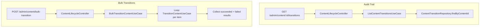

# Operational Excellence Design

**Spec:** `.specs/features/operational-excellence/spec.md`
**Status:** Draft

---

## Architecture Overview

Builds on M1 and M2. Adds a per-content transition history endpoint and a bulk transition endpoint. Minimal new components — mostly extends existing ones.



---

## Code Reuse Analysis

### Existing Components to Leverage

| Component | Location | How to Use |
|---|---|---|
| `TransitionContentUseCase` (M1) | `package/content/management/core/use-case/transition-content.use-case.ts` | Called per-item in bulk transitions |
| `ContentTransitionRepository` (M1) | `package/content/management/persistence/repository/content-transition.repository.ts` | Add `findByContentId()` method |
| `ContentLifecycleController` (M1) | `package/content/management/http/rest/controller/content-lifecycle.controller.ts` | Add new endpoints |

### Integration Points

| System | Integration Method |
|---|---|
| TransitionContentUseCase | Bulk calls in a loop, catching errors per item |
| ContentTransitionRepository | New query method for per-content history |

---

## Components

### ListContentTransitionsUseCase

- **Purpose:** Return full transition history for a specific content item
- **Location:** `package/content/management/core/use-case/list-content-transitions.use-case.ts`
- **Interfaces:**
  - `execute(contentId: string): Promise<ContentTransition[]>`
- **Dependencies:** `ContentTransitionRepository`

### BulkTransitionContentUseCase

- **Purpose:** Transition up to 50 content items, collecting partial results
- **Location:** `package/content/management/core/use-case/bulk-transition-content.use-case.ts`
- **Interfaces:**
  - `execute(contentIds: string[], targetState: PublishingStatus, triggeredBy: string): Promise<BulkTransitionResult>`
- **Dependencies:** `TransitionContentUseCase`

### DTOs

- **TransitionContentDto:** `{ targetState: PublishingStatus, reason?: string }` (request)
- **BulkTransitionDto:** `{ contentIds: string[], targetState: PublishingStatus }` (request)
- **BulkTransitionResponseDto:** `{ succeeded: [{id, newState}], failed: [{id, reason}] }` (response)
- **ContentTransitionResponseDto:** `{ id, previousState, newState, triggeredBy, reason, transitionedAt }` (response)

---

## Data Models

### BulkTransitionResult

```typescript
interface BulkTransitionResult {
  succeeded: Array<{ id: string; newState: PublishingStatus }>;
  failed: Array<{ id: string; reason: string }>;
}
```

No new entities — reuses `ContentTransition` from M1.

---

## Error Handling Strategy

| Error Scenario | Handling | User Impact |
|---|---|---|
| Bulk exceeds 50 items | `400 Bad Request` with limit message | Admin sees clear limit error |
| Individual item fails in bulk | Caught, added to `failed` array, processing continues | Admin sees partial results |
| Content ID not found in bulk | Added to `failed` with "content not found" reason | Admin sees which items failed |
| Empty contentIds array | `400 Bad Request` | Admin sees validation error |

---

## Tech Decisions

| Decision | Choice | Rationale |
|---|---|---|
| Bulk processing | Sequential loop with try/catch per item | Each item needs its own transaction and audit record; parallel would complicate error handling |
| Bulk limit | 50 items | PRD requirement; prevents abuse of the endpoint |
| `reason` field on transitions | Optional, max 500 chars | Validated via class-validator `@MaxLength(500)` |
| Per-content transition history | Direct query to ContentTransition table | Simple `WHERE contentId = :id ORDER BY transitionedAt DESC`; no pagination needed for V1 |
